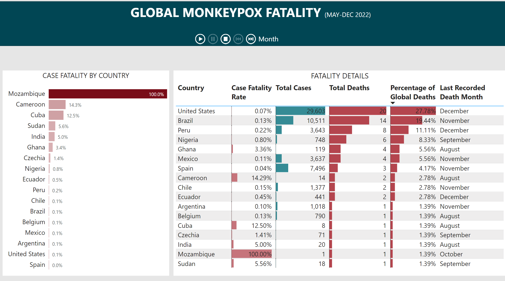
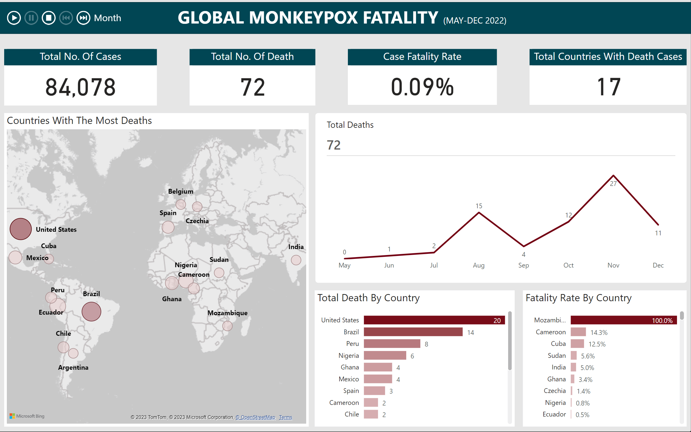

# Store-Analysis-With-PowerBI
Analysis of sales for a Nigerian Superstore using PowerBI

Parch and Posey Company
Parch and Posey is a company that sells paper
They have 50 sales reps spread across 4 regions in America
They sell 3 types of papers
1.	Standard
2.	Gloss
3.	Poster
Their customers are large companies they attract by advertising on Google, Facebook and Twitter

In the Parch & Posey database, there are five tables (essentially 5 spreadsheets):
1.	web_events
2.	accounts
3.	orders
4.	sales_reps
5.	region

## Data Cleaning

* Introduction
* Analysis
* Conclusion
* Recommendation
